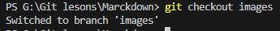

# Пользуемся Marckdown и Git

# Команды Git

## **git init**  
* инициализация локального репозитория (*папки проекта*)
> *Пример*: git init .\my_document

## **git status** 
* получить информацию от git о его текущем состоянии

Вписываешь в терминал
> 

Если нечего сохранять или не сделал add ответ будет таким

(если не сохранил изменения Ctrl+S)

> 

## **git add** 
* добавить файл или файлы к следующему коммиту

> 

## **git commit -m “message”** 
* создание коммита.

> 

## **git log** 
* вывод на экран истории всех коммитов с их хеш-кодами

> 

## **git log --graph**
* показать древо проэкта

>

## **git checkout** 
* переход от одного коммита или ветки к другому (*другой*) 

> 

## **git checkout master**
* вернуться к актуальному состоянию и продолжить работу

> 

## **git diff** 
* увидеть разницу между текущим файлом и закоммиченным файлом

>

## P.S. Команда "clear" введенная в терминале очистит терминал.

# Основные приемы Marckdown
## Выделение текста

Чтобы выделить текст курсивом заключи его в "*" 

Пример : *пример текста*

Чтобы сделать текст полужирным заключи его в "**" 

Пример : **пример текта**

Также есть альтернативный знак выделения "_" используется чтобы совместить в _тексте и курсив и полужирное **выделение текста**_.

## Списки

Чтобы сделать не нумерованный список ставь знак "*" перед текстом.

Пример :
* пункт 1
* пункт 2
* пункт 3

Чтобы пронумеровать список проставь нумерацию.

Пример :
1. Пункт первый
2. Пункт второй

## Работа с изображением

Чтобы добавить изображение пиши 

## Ссылки

Для включения ссылок в текст пиши
Пример:
Переходи по ссылке https://gb.ru/ или так ["Geek brains"]( https://gb.ru/)

## Работа с таблицами

Пример таблицы
 Столбец | Столбец 2
|-|-|
Значение |Значение 2
-|- 
-|- 
Итог|Сумма 
|-|-| 

## Цитаты

Чтобы добавить цитату ставь знак ">" перед текстом.

Пример:
>Вот такой вот пример да получается да да я

## Заключение

###  _В этом тексте **БАЗА**_
 **Выше преведены пример начальной работы в Marckdown и команды для GIT**

[Больше функций Marckdown](https://docs.microsoft.com/ru-ru/contribute/markdown-reference) 
 
<!-- Текст подготовлен для сдачи практической работы в gb
